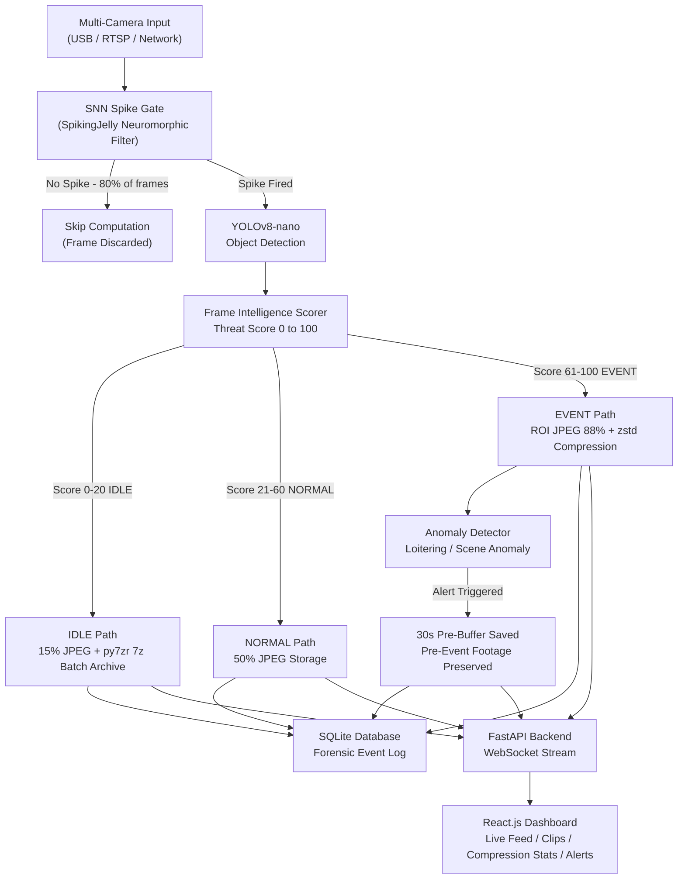

# VICSTA Hackathon – Grand Finale

**VIT College, Kondhwa Campus | 5th – 6th March**

---

## Team Details

**Team Name:** Team Spectrum

**Members:**

- Veer Gandhi
- Sanchit Borikar
- Purvesh Didpaye
- Ashraf Ahmed

**Domain:** Productivity & Security (Problem Statement ID: PS-04)

---

## Project

**EdgeVid LowBand — The Camera That Thinks**

### Problem

> Over 20 million surveillance cameras record every frame with identical priority, generating petabytes of footage that no one ever watches — at an estimated cost of Rs. 40,000 per month per deployment. Existing binary motion-detection systems fire on irrelevant stimuli such as passing shadows, while remaining entirely blind to high-risk stillness — a loiterer standing motionless goes completely undetected. The result is a surveillance infrastructure that wastes compute, storage, and human attention simultaneously.

### Solution

> EdgeVid LowBand is a neuromorphic edge-AI DVR that makes the camera intelligent at the source — with zero cloud dependency and a 70% reduction in storage footprint.

- **SNN Spike Gate** — A Spiking Neural Network (SpikingJelly) acts as a biological neural filter, evaluating every frame and firing a spike only when activity warrants inference. Approximately 80% of idle frames are skipped entirely before YOLOv8 ever runs, eliminating redundant computation at its source.
- **YOLOv8-nano Scoring Engine** — On a spike, YOLOv8-nano performs real-time object detection and assigns each frame a continuous threat score from 0 to 100, classifying it as IDLE, NORMAL, or EVENT.
- **Dynamic ROI Compression** — Score-driven dual-layer compression: EVENT frames retain the subject region at 88% quality via ROI JPEG + zstd, compressing the background to 12%. NORMAL frames use 50% JPEG. IDLE frames are batched into py7zr (.7z) LZMA2 archives — achieving over 99% compression on static background sequences.
- **70% Storage Reduction** — The combination of intelligent frame skipping, tiered quality encoding, and LZMA2 batch archiving delivers a verified 70% reduction in total storage consumption compared to conventional DVR systems.
- **Predictive 30-Second Pre-Buffer** — A circular pre-buffer runs continuously. When a loitering or anomaly alert fires, the 30 seconds of footage preceding the event is automatically preserved — capturing the build-up, not just the incident.
- **SQLite Forensic Event Log** — Every classified event, detection, alert, and compression action is written to a local SQLite database with full metadata, timestamps, and severity scores for audit and review.
- **Live Surveillance Dashboard** — A React.js frontend streams real-time camera feed, compression statistics, neural spike activity visualisation, recorded clips, and forensic logs via FastAPI WebSocket — with no external cloud calls at any point.

---

## System Architecture

---

## Rules to Remember

- All development must happen during the hackathon only
- Push code regularly — commit history is monitored
- Use only open-source libraries with compatible licenses and credit them
- Only one submission per team
- All members must be present both days

---

## Attribution

This project is built entirely on open-source technology:

| Library | Role | License |
|---|---|---|
| **SpikingJelly** | Neuromorphic Spiking Neural Network gate | Apache-2.0 |
| **YOLOv8-nano** (Ultralytics) | Real-time object detection and threat scoring | AGPL-3.0 |
| **OpenCV** | Camera capture, frame processing, ROI extraction | Apache-2.0 |
| **FastAPI** | High-performance async backend and WebSocket server | MIT |
| **React.js** | Real-time surveillance dashboard frontend | MIT |
| **SQLite** | Local forensic event database | Public Domain |
| **zstandard (zstd)** | High-speed lossless compression for EVENT frames | BSD |
| **py7zr** | LZMA2 batch archiving for IDLE frame sequences | LGPL-2.1 |

---

> "The world is not enough — but it is such a perfect place to start." — James Bond

All the best to every team. Build something great.
