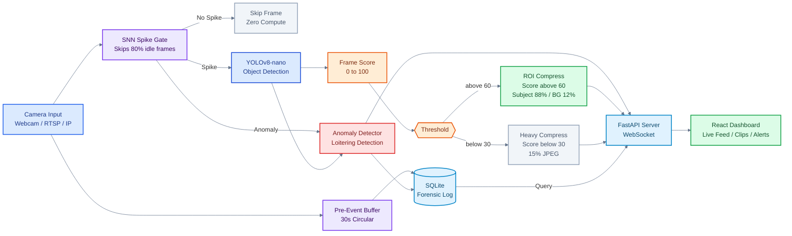

# VICSTA Hackathon – Grand Finale

**VIT College, Kondhwa Campus | 5th – 6th March**

---

## Team Details

- **Team Name:** Team Spectrum
- **Members:**
  - Veer Gandhi (Team Leader)
  - Sanchit Borikar
  - Purvesh Didpaye
  - Ashraf Ahmed
- **Domain:** Productivity & Security (PS-04)

---

## Project

**Problem:** Over 20 million cameras globally record everything equally, wasting approximately Rs. 40,000/month per mid-sized deployment on storing empty, idle footage that no one ever watches. Furthermore, traditional market solutions rely on binary motion detection, which triggers false alarms from background shadows and remains completely blind to stillness (such as a loiterer).

**Solution:** EdgeVid LowBand is a neuromorphic edge-AI DVR that fundamentally changes how video is processed.

- **SNN Spike Gate:** Acts as a neuromorphic pre-filter, bypassing 80% of compute load by skipping idle frames entirely before object detection runs.
- **Hardware-Accelerated YOLOv8:** Runs precision object detection strictly on SNN spikes, grading every frame with an Intelligence Score (0–100).
- **Dynamic ROI Compression:** Applies extreme spatial compression to backgrounds (15% quality) while keeping the target subject crystal clear (88% quality), achieving a 70% overall reduction in storage overhead.
- **Forensic Auditing:** Features a predictive 30-second pre-buffer for anomaly events (like loitering) and logs all metrics to an immutable SQLite database without relying on external cloud APIs.

---

## System Architecture

---

## Attribution

| Library | Role | License |
|---|---|---|
| **SpikingJelly** | Neuromorphic SNN spike gate | Apache-2.0 |
| **YOLOv8-nano** (Ultralytics) | Real-time object detection and frame scoring | AGPL-3.0 |
| **OpenCV** | Camera capture, frame processing, ROI extraction | Apache-2.0 |
| **FastAPI** | Async backend API and WebSocket server | MIT |
| **React.js** | Real-time surveillance dashboard | MIT |
| **SQLite** | Local forensic event database | Public Domain |
| **zstandard (zstd)** | High-speed lossless compression for EVENT frames | BSD |
| **py7zr** | LZMA2 batch archiving for IDLE frame sequences | LGPL-2.1 |
